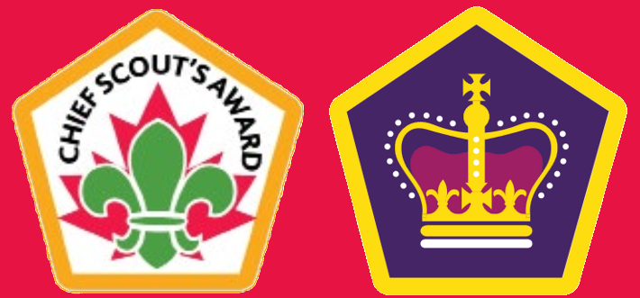
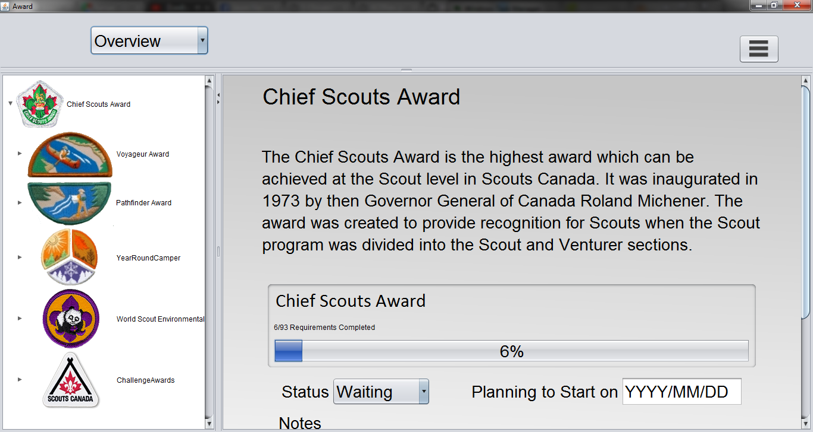
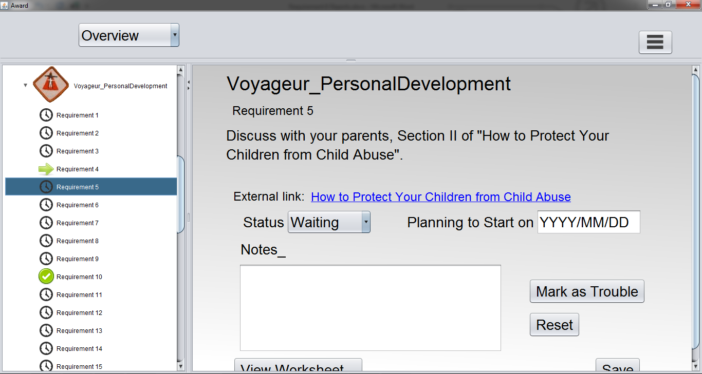
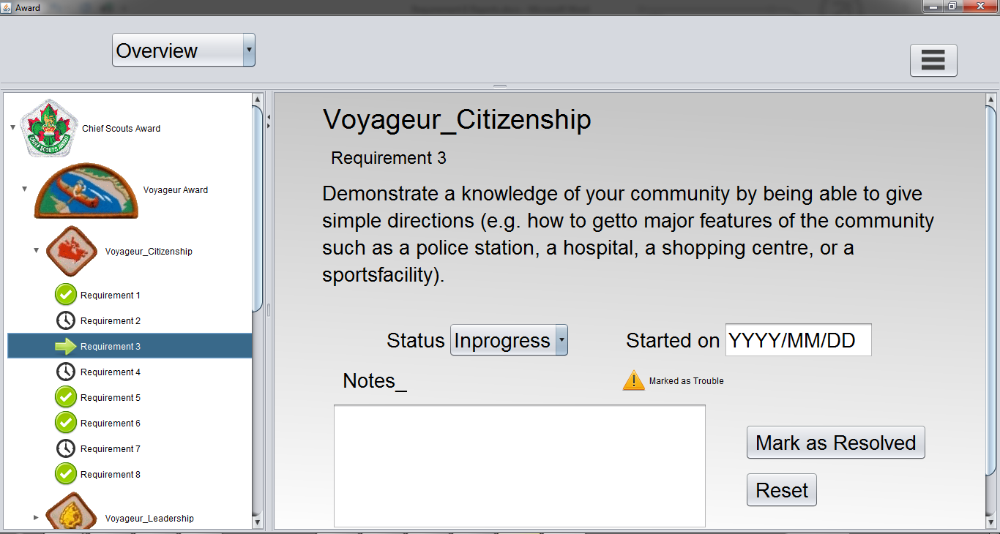

  

## What it does

The Badge Manager provides a clean and organized platform for scouts to log their progress for badges and awards. The program is an encyclopedia for the various awards and achievements of Scouts Canada: users can browse through the different requirements, where they can record notes and progresses. Using these information, the program generates to-do lists as well as progress bars to aid the user to plan future meetings and activities. 

## How we built it

The user-interface is written using **Java (Swing)**, while the user data is kept in a table created in and using **MySQL**. 

## Setup guide

To run this program, after cloning our repository you will want to set up MySql. [Download and install MySql](https://dev.mysql.com/downloads/). 
You can either compile the code in scr/Pane (main.java), or run Checklist.jar directly after installing MySql. 

## Screenshots

  

  

  

